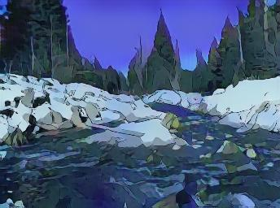

# CartoonGAN-predictor
This is unofficial torch implementation for prediction of the paper, "CartoonGAN: Generative Adversarial Networks for Photo Cartoonization" [1]

Input photo | Miyazaki Hayao style
 --- | --- 
 | 

## Requirements
* Lua 5.1
* argparse
* torch7
* GPU environment

## Pre-trained models
You can download pre-trained models from author' page. [[Link]](http://cg.cs.tsinghua.edu.cn/people/~Yongjin/Yongjin.htm)

## Usage
### Options
* `--input`: The path to an input file.
* `--input_dir`: The path to an input directory. If you specify this option, prediction will be done for all files under the specified directory regardless of the `--input` option.
* `--output`: The path to an output file. This option is paired with the `--input` option.
* `--output_dir`: The path to an output directory. This option is paired with the `--input_dir` option.
* `--model`: The path to a pre-trained model.

### Example
```bash
th predict.lua --input example/real.jpg --output example/cartoonized.jpg --model models/Hayao_net_G.t7
```

## Reference
* [1] Yang Chen, Yu-Kun Lai, Yong-Jin Liu. "CartoonGAN: Generative Adversarial Networks for Photo Cartoonization", in CVPR 2018. [[Paper]](http://openaccess.thecvf.com/content_cvpr_2018/CameraReady/2205.pdf)
